# Teste de Eng. de Dados de Danilo Freitas - Mesha Tecnologia

<div align="center">


</div>

Critérios avaliadas:
- Docker :white_check_mark:
- SQL :white_check_mark:
- Python :white_check_mark:
- Organização do Código :white_check_mark:
- Documentação :white_check_mark:
- ETL :white_check_mark:
- Modelagem dos dados :white_check_mark:

Desejáveis
- PySpark :white_check_mark:
- Esquema Estrela :white_check_mark:

### Base de Dados

- A base de dados selecionada para esse desafio técnico está disponível em: [Base de Dados](https://download.inep.gov.br/microdados/microdados_enem_2020.zip).

- Após o download e de descompactar, o arquivo csv utilizado está localizado em: `microdados_enem_2020/DADOS/MICRODADOS_ENEM_2020.csv`.

### Arquitetura e Features escolhidas para o projeto

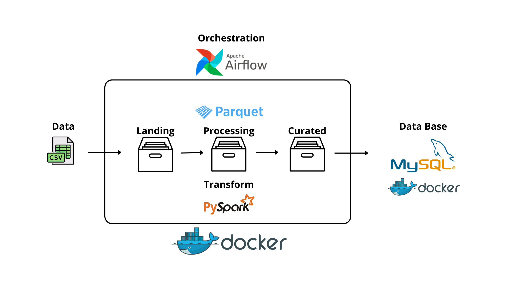

Visando atender aos critérios estabelecidos para este projeto e da utilização das principais features presentes no mercado, as seguintes ferramentas foram selecionadas:

- Airflow: Processo ETL totalmente orquestrado e de fácil replicação;
- PySpark: Uma das principais bibliotecas de Big Data;
- Parquet: Formato de arquivo mais performático;
- MySQL: Requisito do projeto, é um dos DBs mais utilizados no mercado;
- Jupyter: Notebook de desenvolvimento do projeto (Etapa de desenvolvimento).

### Esquema

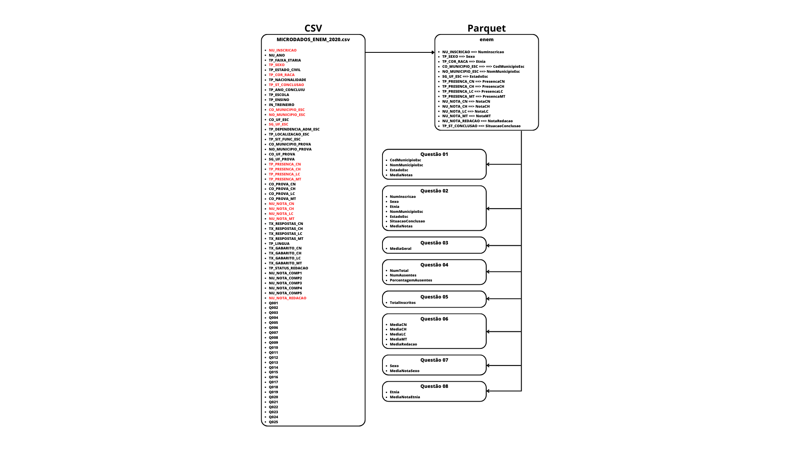

## Step by Step

### 1) Desenvolvimento do código PySpark

#### Obtenção do arquivo CSV
O primeiro passo do projeto foi o desenvolvimento do código PySpark. Para isso, após o download e a descompactação do arquivo foi criado o diretório `dados` e dentro dele o diretório `raw`. Dentro do diretório row foi disponibilizado o arquivo csv: `MICRODADOS_ENEM_2020.csv`.

#### Acesso ao Notebook Jupyter
Um segundo diretório foi criado `notebook` e dentro dele o arquivo `desenvolvimento.ipynb`. O seu acesso foi por meio do Jupyter, na qual foi instalado localmente o Acaconda ([Documentação - Link](https://docs.anaconda.com/free/anaconda/install/linux/)).

Para acesso ao Notebook Jupyter o seguinte comando foi executado:

  ```  jupyter notebook --ip 0.0.0.0 --port 8888 --no-browser --allow-root ```

O acesso local ao notebook ocorreu pelo `https://localhost:8888`.

#### Desenvolviemnto do código PySpark
Dentro do notebook `desenvolvimento.ipynb` foi desenvolvido todo o código que posteriormente irá ser apresentado durante a construção da DAG Airflow. O notebook desenvolvido para este projeto está disponível em: `notebook/desenvolvimento.ipynb`

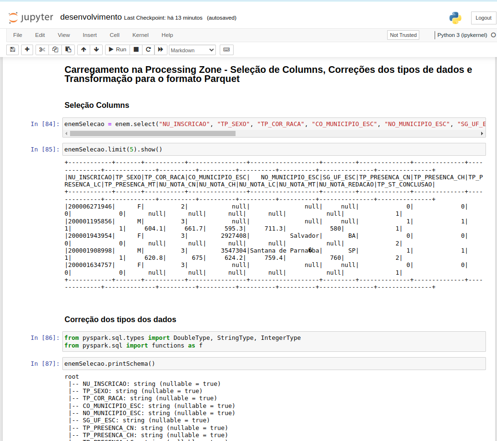

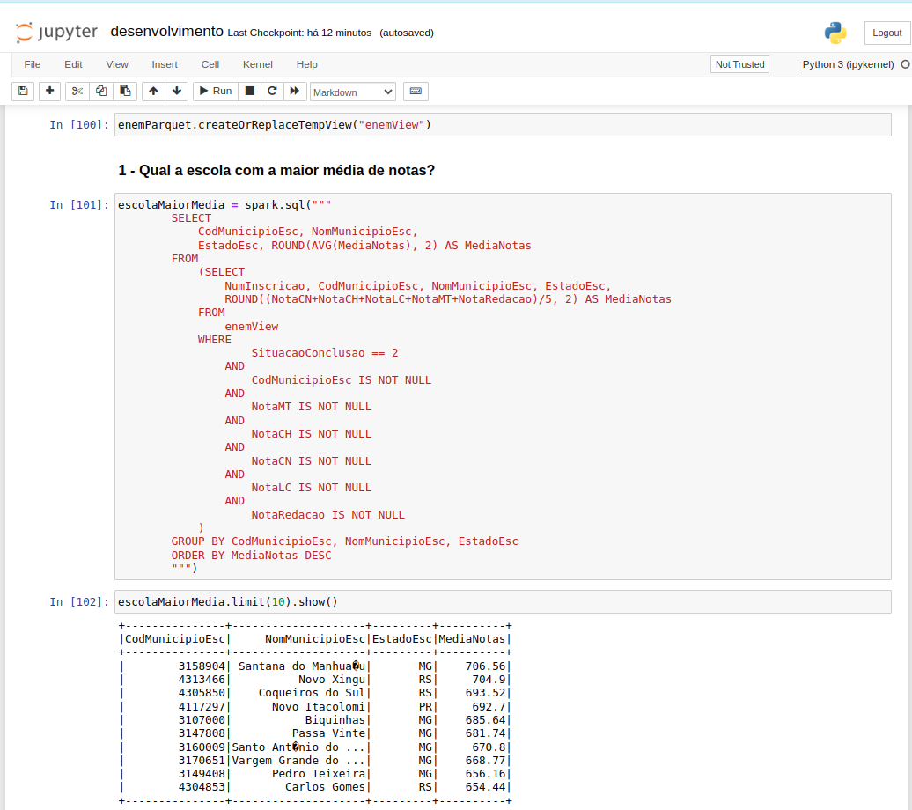

##### Acesso aos dados

Para obter os dados e executá-los no notebook Jupyter utilizado é necessário baixar o CSV. O código bash está disponível em `setup.sh` -> `data`. Na qual é composto pelo seguinte código:

``` 
    mkdir dados
    cd dados
    mkdir raw
    mkdir processing
    cd raw
    wget --no-check-certificate https://download.inep.gov.br/microdados/microdados_enem_2020.zip
    unzip microdados_enem_2020.zip
    mv DADOS/MICRODADOS_ENEM_2020.csv ..
```


### 2) Criação do ambiente - Container Docker (MySQL e Airflow)

#### Docker - MySQL e Airflow

A construção do ambiente de arquitetura do projeto se inicia nesta etapa. 

#### MySQL
Primeiramente é necessário a instalação de dois containers Docker. O container MySQL é obtido por meio do arquivo `docker-compose.yml` localizado no diretório deste projeto.

Dentro do arquivo `docker-compose.yml` é necessário definir o password_root, database, user e password para o ambiente do banco de dados. Por padrão para este projeto foi definido para todos os parâmetros a palavra `mesha`. A porta escolhida para o MySQL foi a `3306`.

Após o entendimento dos parâmetros do container MySQL, basta executá-la pelo comando:

``` docker compose up```

Para obter o acesso do nosso MySQL basta observar qual IPAddress ele está alocado pelo comando:

``` docker container inspect db ```

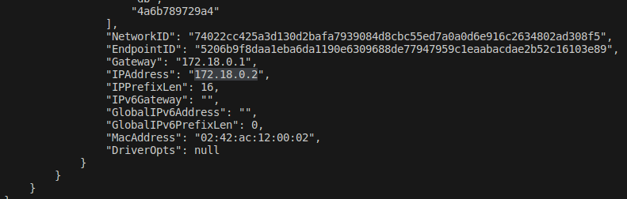

No conector do DB o host deve ser definido pelo IPAddress observado e os outros parâmetros definidos em `docker-compose.yml` (username e password). A porta escolhida para o MySQL é a `3306`.

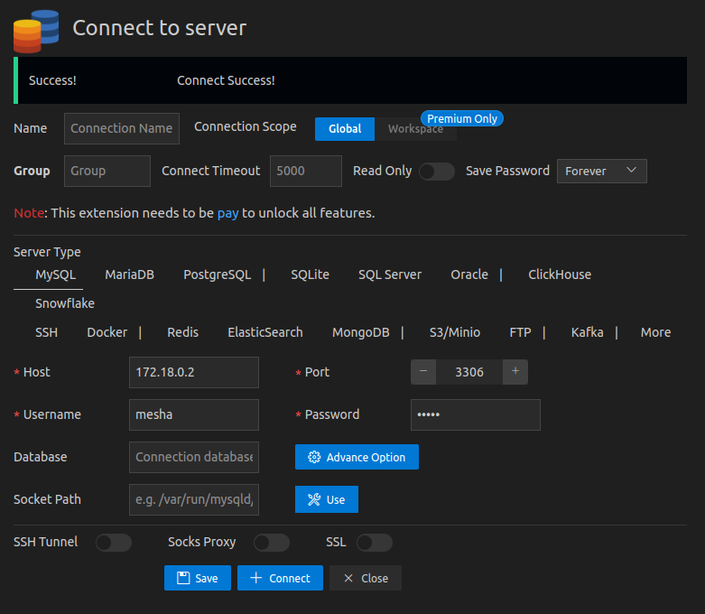

#### Airflow

Todos os comandos bash para a instalação do container Airflow está localizado em `setup.sh` -> `install`.

##### Instalação do container Airflow

Primeiramente o comando abaixo deve ser executado para a instalação do container:

```    
docker run -d -p 8080:8080 -v "$PWD/airflow/dags:/opt/airflow/dags/" --entrypoint=/bin/bash --name airflow apache/airflow:2.1.1-python3.8 -c '(airflow db init && airflow users create --username admin --password admin --firstname Danilo --lastname Freitas --role Admin --email admin@example.org); airflow webserver & airflow scheduler'
```
Nele está definido a porta `8080` e o username/password, definido para este projeto como `admin`.  

##### Instalação de dependências dentro do container Airflow

O seguinte processo deve ser executado para a instalação das dependências necessárias para o correto funcionamento do Airflow com a DAG construída:

1) `docker container exec -it -u root airflow bash`

2) ``` 
    apt update && \
    apt-get install -y openjdk-11-jdk && \
    apt-get install -y ant && \
    apt-get clean;
    ```
Para a conexão entre a DAG do airflow com o MySQL é necessária baixar o arquivo conector `mysql-connector-j-8.0.33.jar` dentro do container, seguir as etapas:

Ainda dentro do bash root do container:

3) ```
    apt-get install wget`
    apt-get install unzip
    ```


4) ```
    mkdir jars
    cd jars
    wget https://repo1.maven.org/maven2/com/mysql/mysql-connector-j/8.0.33/mysql-connector-j-8.0.33.jar
    cd ..
    ```

5) Sair do root bash do container ou abrir outro terminal

6) `docker container exec -it airflow bash` 

7) `pip install pymysql xlrd openpyxl pyspark findspark install-jdk`

Baixando o arquivo CSV dentro do container (ainda no bash do container):

8) ```
    mkdir dados
    cd dados
    mkdir raw
    mkdir processing
    cd raw
    wget --no-check-certificate https://download.inep.gov.br/microdados/microdados_enem_2020.zip
    unzip microdados_enem_2020.zip
    ```

9) Após a finalização ambos os bash dos container pode ser fechado

#### Conexão entre os containers Airflow/MySQL

A última etapa de configuração dos containers consiste na conexão entre ambos, para isso deve ser executada as seguintes etapas no terminal:

1) Criação de um network para conexão: `docker network create my-net`
2) Criar uma conexão da network para cada container:
- `docker network connect my-net db`
- `docker network connect my-net airflow`

3) Inspecionando o container db para a obtenção do IPAddress do network my-net
- `docker container inspect db`

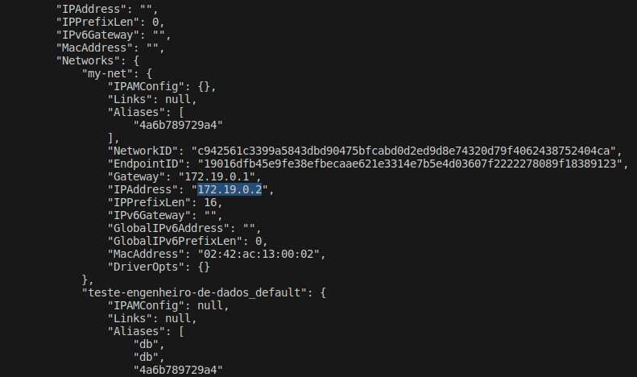

Por exemplo, neste caso o IPAddress do network entre o container db e airflow é `172.19.0.2`.

#### Definição dos parâmetros de conexão entre os containers Airflow/MySQL

Agora basta definir os parâmetros para conexão no diretório `airflow/dags/mysqlairflow.py`. Por exemplo, neste caso em url é definido como 172.19.0.2/mesha que é o IPAddress é o nome do database e o user/password como `mesha` (definidos no `docker-compose.yml`).

### 3) Execução do ambiente Airflow

#### Apresentação da DAG construída

A DAG deste projeto está localizada no diretório `airflow/dags/etl_dag.py`. A DAG `etl_dag.py` apresenta a seguinte estrutura:

1) Importações de dependências

```
from mysql import url, driver, user, password
from datetime import datetime,date, timedelta
from airflow import DAG
from airflow.operators.python_operator import PythonOperator
from airflow.models import Variable
from pyspark.sql import SparkSession
from pyspark.sql.types import DoubleType, IntegerType 
from pyspark.sql import functions as f
import findspark
```

2) Configurações gerais do Airflow (Schedule, Date)

```
DEFAULT_ARGS = {
    'owner': 'Airflow',
    'depends_on_past': False,
    'start_date': datetime(2020, 1, 1),
}

dag = DAG('etl_data', 
          default_args=DEFAULT_ARGS,
          schedule_interval="@once"
        )
```

3) Inicialização do PySpark (conexão com a dependência jars do mysql):

```
findspark.init()

spark = SparkSession \
        .builder \
        .appName('PySpark MySQL Connection') \
        .master('local[*]') \
        .config("spark.jars", "/opt/airflow/jars/mysql-connector-j-8.0.33.jar") \
        .getOrCreate()
```

4) Localização dos diretórios utilizados no processo de orquestração do Airflow

```
pathRow = "/opt/airflow/dados/raw/DADOS/MICRODADOS_ENEM_2020.csv"
pathParquetProcessing = "/opt/airflow/dados/processing"
pathCurated = "/opt/airflow/dados/curated"
```

5) DAGs

O arquivo contém 9 funções que constituem as etapas do processo de orquestração.

A primeira função da DAG é responsável pela: extração dos dados, seleção das colunas, correções dos tipos dos dados e transformação para o formato Parquet.

As 8 funções seguintes são responsáveis por cada questão do teste, após o seu processo de seleção dos dados eles são encaminhados automaticamente para o MySQL deste projeto.

#### Execução da DAG no ambiente Airflow

O acesso do airflow UI é por meio da porta 8080 da sua máquina local `http://localhost:8080`. O User/Password para acesso foram definidos na etapa de construção do container, para este projeto `admin`.

Após o acesso ao Airflow UI com as credenciais User/Password é possível visualizar a DAG.

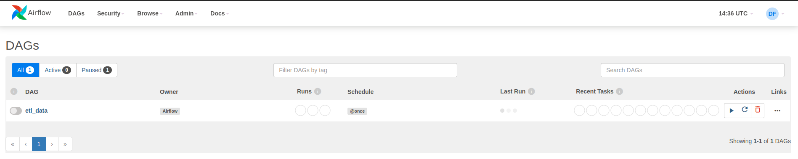

Ao acessor o Airflow é possível observar de forma visual em `Graph View` o processo ETL dos dados deste projeto. 

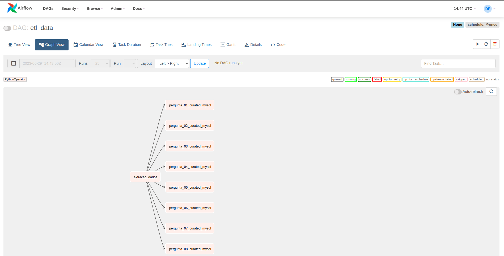

Agora já é possível executar e observar o andamento das etapas, basta ATIVAR a DAG e adicionar um `trigger DAG`, após a finalização todas as tabelas estarão disponível no MySQL do projeto.

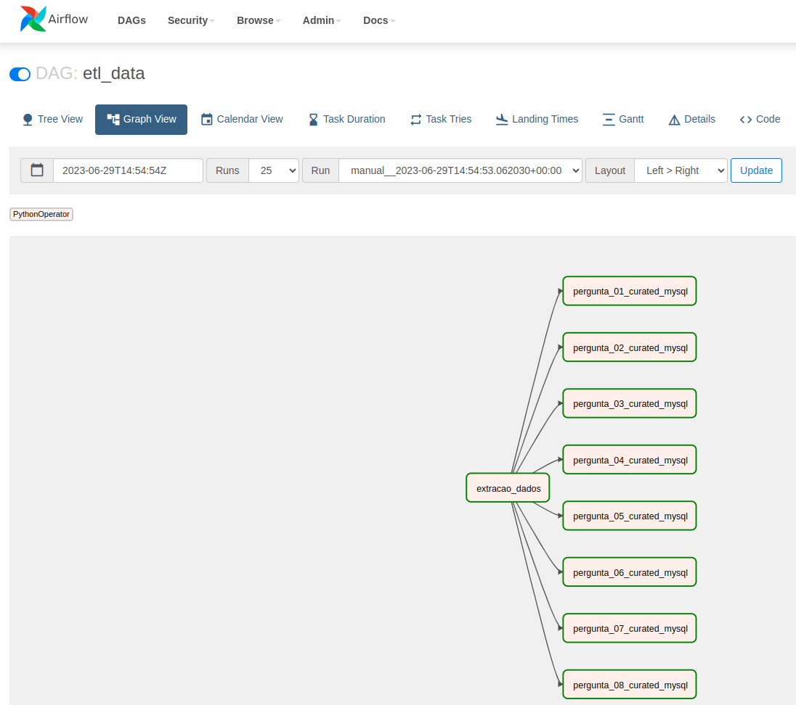

#### Visualização das tabelas no MySQL

Após a finalização do processo ETL já é possível visualizar as tabelas no MySQL:

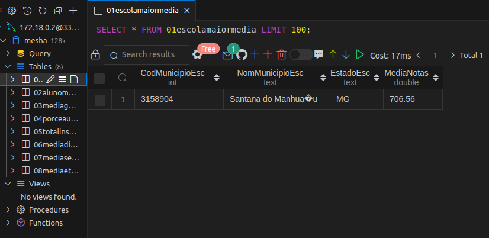

Agora já é possível vizualizar as tabelas criadas no DataBase.

### Perguntas respondidas:

1. Qual a escola com a maior média de notas? :white_check_mark:

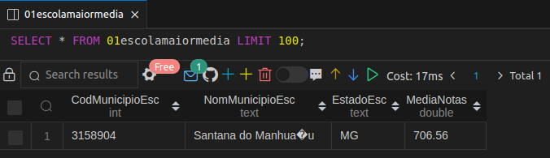

2. Qual o aluno com a maior média de notas e o valor dessa média? :white_check_mark:

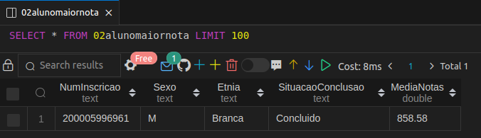

3. Qual a média geral? :white_check_mark:

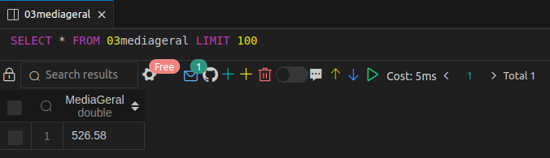

4. Qual o % de Ausentes? :white_check_mark:

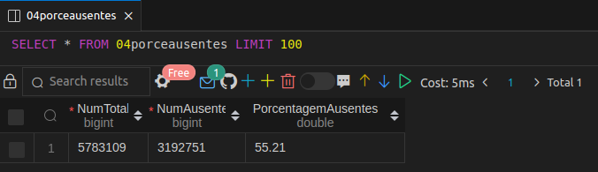

5. Qual o número total de Inscritos? :white_check_mark:

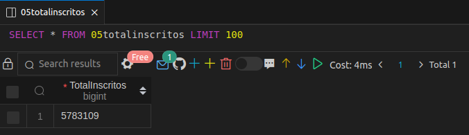

6. Qual a média por disciplina? :white_check_mark:

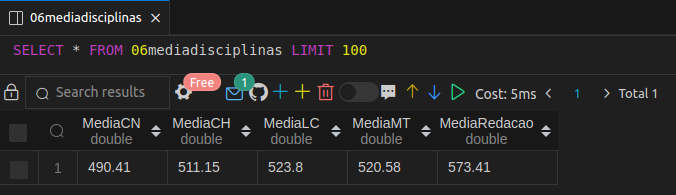

7. Qual a média por Sexo? :white_check_mark:


8. Qual a média por Etnia? :white_check_mark:

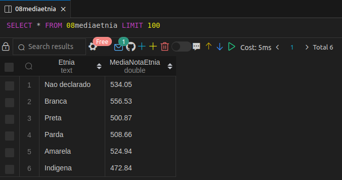
